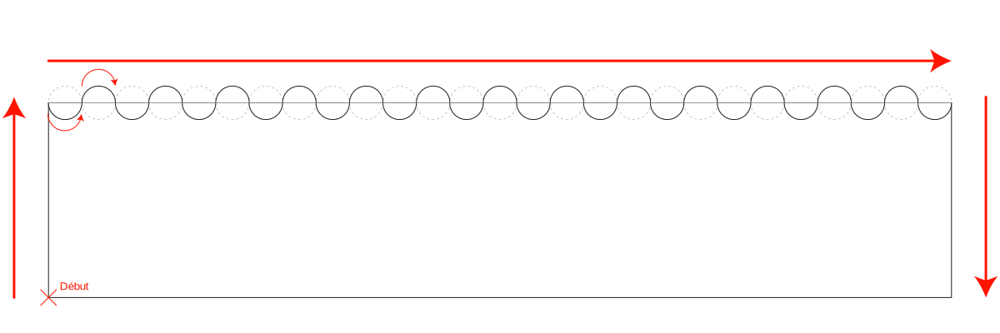
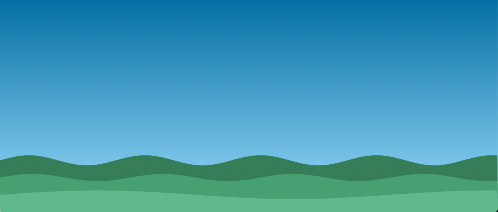
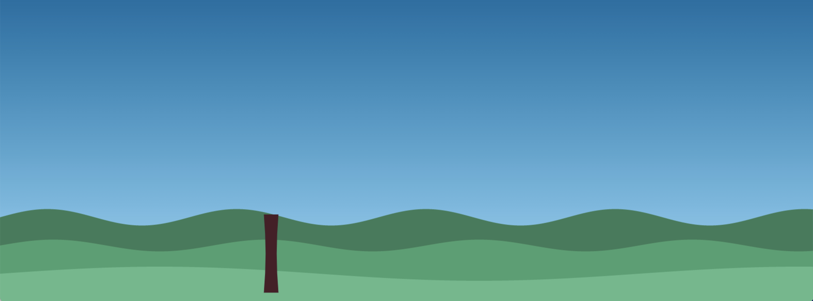
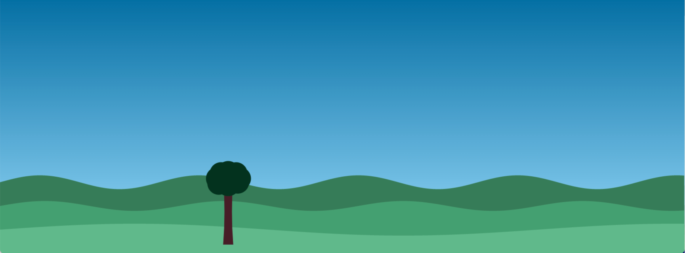
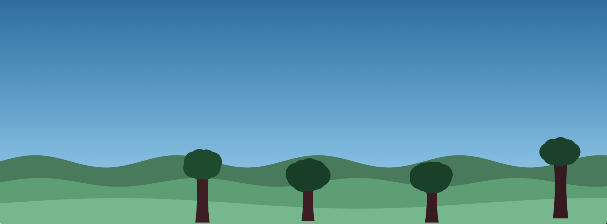
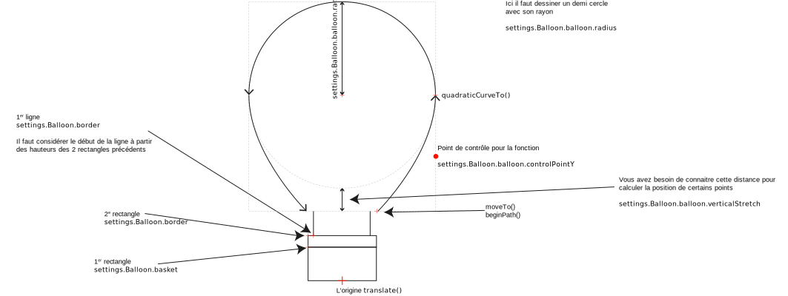
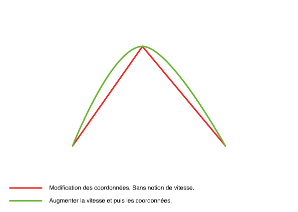

# Vol en montgolfière

> A JS exercise use at HEPL for MMI.

* * *

**hot-air-balloon** is an educational project, which will be used for `JS` courses.

**Note:** the school where the course is given, the [HEPL](https://hepl.be) from Liège, Belgium, is a French-speaking school. From this point, the instruction will be in French. Sorry.

* * *

Vous pouvez voir le projet [ici](https://hepl-mmi.github.io/hot-air-balloon) 

## Énoncé

Dans un premier temps, il est nécessaire de dessiner les différentes parties du jeu. Au début, il peut être intéressant de travailler avec des valeurs simples que vous écrivez en dur dans votre code. Pensez toujours à simplifier votre problème.

## Dessiner les éléments du jeu

1. Mettez à jour les dimensions du canvas, il doit prendre toute la place disponible dans la fenêtre. Ceci doit fonctionner aussi au redimensionnement de la fenêtre. 
2. Commencez par dessiner le ciel. Il s'agit d'un simple dégradé. Les couleurs sont définies dans le fichier `settings.ts`. 
3. Poursuivez en dessinant les talus. Dessinez une forme à l'aide d'un chemin comme vous pouvez le voir dans le schéma. Bien entendu, vous devez, pour dessiner la courbe, vous servir de la fonction *sinus* ou *cosinus*. L'idée étant de parcourir pixel par pixel la longueur du canvas. Vous devez vous servir des fonctions `moveTo`, `lineTo` et `fill`. Une fois que vous parvenez à dessiner ceci alors, voyez comment moduler cette courbe. Pour se faire, il suffit de passer des  valeurs plus petites à la fonction *sinus*. Puis d’augmenter le résultat, renvoyé par la fonction *sinus*, par une multiplication. 
Essayer d'ajouter des petits sapins sur les derniers talus. Cette information est signalée par la propriété `withFir` dans le fichier de configuration.
4. Essayez maintenant de dessiner le tronc d'un arbre. Mais avant de le dessiner, il est nécessaire d'aller lire la page de documentation de la fonction [quadraticCurveTo()](https://developer.mozilla.org/fr/docs/Web/API/CanvasRenderingContext2D/quadraticCurveTo). Peut-être est-il même intéressant de tester un peu cette fonction afin de bien comprendre comment elle fonctionne. Une fois que vous avez compris le rôle de chaque paramètre, vous devriez, en vous aidant de ce schéma, pouvoir dessiner le tronc. 
5. Maintenant, il ne vous reste plus qu'à dessiner la couronne de l'arbre. Pour se faire, il s'agit de dessiner plusieurs cercles qui se superposent. Les centres des cercles sont calculés à partir d'un autre cercle imaginaire d'un rayon aléatoire. Autrement dit, vous devez calculer à l'aide de la fonction *sinus* et *cosinus* les coordonnés `x` et `y` des centres des cercles qui se trouvent donc sur le périmètre de ce cercle imaginaire.   
    Ce cercle virtuel peut être plus large que haut ainsi ça donne un effet moins parfait à la couronne.
6. Générer plusieurs arbres, tels que définis dans le fichier `setting.ts` avec des distances et couleurs aléatoires . 
7. Maintenant, il ne vous reste plus qu'à dessiner la montgolfière. Celle-ci est composée de plusieurs parties comme le montre ce schéma. L'origine se trouve en bas au milieu. C'est à partir de là que vous devez calculer les coordonnées `x` et `y` des différents points dont vous avez besoin. Vous pouvez si vous le souhaitez dans un premier temps travailler avec des valeurs directes. Dans un 2e temps, il faudra se servir du fichier `settings.ts` pour rendre paramétrable la montgolfière. 

## Animation

Dans cette partie de l'énoncé, il s'agit d'animer les différents éléments du jeu. Les contraintes techniques sont délibérément moins précises. C'est l'occasion pour vous de réfléchir aux solutions. Vous allez vous rendre compte qu'un des enjeux majeurs sera de garder les performances stables. Le jeu pourrait rapidement s’ouvrir d’une lenteur.

1. Commencez par animer les arbres. Ils se déplacent de la droite vers la gauche pixel par pixel. Il est attendu qu'un arbre qui sort de la scène provoque une nouvelle apparition. Vous pouvez chercher à rendre cette apparition un peu plus aléatoire afin d'éviter qu'un arbre qui vient de sortir provoque immédiatement l'apparition d'un nouvel arbre. 
2. Il faut également animer la montgolfière. Il s'agira de mettre à jour les coordonnées. Il est plus intéressant, afin d'avoir un effet plus naturel, d’augmenter la vélocité qui à son tour déplace les coordonnées. Ainsi le déplacement n’est pas linéaire. Cette vélocité augmente quand le joueur enfonce la flèche de navigation. Notez que les déplacements en `x` doivent se faire très lentement sans quoi on arrive trop rapidement en dehors de la scène. D’ailleurs, la vélocité, donc la vitesse, ne peut pas excéder les valeurs renseignées dans le fichier `settings.ts`, sinon la montgolfière se déplacera trop vite et trop loin. 
3. Il est également nécessaire de calculer les collisions. Pour ce faire, vous devez considérer les coins du panier et calculer la collision avec tous les cercles qui composent la couronne de tous les arbres contenue dans la scène. S'il y a collision, vous pouvez dans un premier temps simplement arrêter la boucle d'animation. Dans un deuxième temps, il faudra prévenir le joueur de sa défaite et lui proposer de recommencer.
4. Vous devez également ajouter une jauge pour le carburant. Il s'agit simplement de réduire le pourcentage de carburant à chaque fois qu'on fait monter la montgolfière en considérant la vélocité. Plus vite on monte plus vite, le carburant s’épuise. Une fois qu'il n'y a plus de carburant, le jeu se termine aussi.
5. Vous devez également ajouter un compteur de mètres. Ainsi on connait la distance parcourue. À vous de choisir l’incrémentation. Il est intéressant, dans un premier temps, de le faire pleinement avec canvas et de charger dynamiquement la police de caractère comme suggéré [ici](https://developer.mozilla.org/fr/docs/Web/API/CanvasRenderingContext2D/font#chargement_de_polices_avec_lapi_css_font_loading) dans la documentation ou [ici](https://stackoverflow.com/a/66094821) dans ce fil de conversation. 

À ce stade vous devriez remarquer que votre jeu consomme beaucoup de ressources. Il devient donc lent. Je vous demande de lire [cet article. ](https://developer.mozilla.org/fr/docs/Web/API/Canvas_API/Tutorial/Optimizing_canvas)Il présente les optimisations possibles avec canvas. Voici une liste de points que vous pouvez déjà mettre en place : 

1. Assurez-vous de travailler, le plus possible, avec des nombres entiers.
1. Assurez-vous d’avoir des tableaux qui restent petits. Par exemple le tableau des arbres, des talus, etc.
1. Travailler avec 2 contextes de rendu différents et superposés. Ils se comportent comme des calques dans Photoshop. Un premier contexte pour les éléments inactifs, le ciel, les talus, les sapins, etc. Ce contexte doit être mis à jour uniquement quand on redimensionne la fenêtre. Dans l'autre canvas, vous devez placer les éléments qui nécessitent d'être mis à jour régulièrement. Ainsi dans votre boucle d'animation vous n'animez que les éléments qui doivent réellement être mis à jour sans dessiner l'entièreté de la scène. Notez qu'il est nécessaire d'écrire un peu de CSS pour que les choses se passent correctement. Vous pouvez retrouver ce code [ici](https://github.com/hepl-mmi/hot-air-balloon/blob/completed/src/scss/main.scss).
1. Une deuxième lenteur est induite par le compteur. Il est fortement déconseillé de dessiner du texte avec canvas. Cela consomme beaucoup de ressources. Vous pouvez mettre en place une première stratégie d'optimisation qui consiste à réduire le nombre d'appels vers la fonction qui met à jour ce compteur. Mais cela n'est pas suffisant, il devient donc nécessaire de travailler simplement avec un élément HTML qui contient ce texte et que vous mettez à jour en modifiant le DOM.

